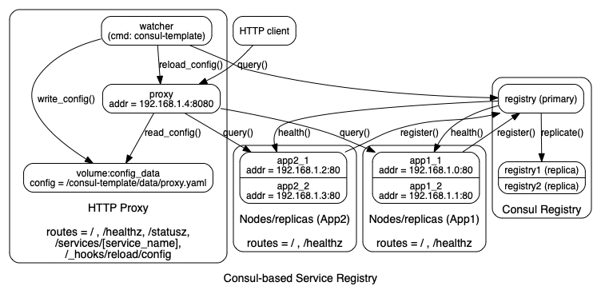

## Consul-based Service Registry

Demos a [Consul-based service registry](https://www.consul.io/discovery.html)
that renders a service manifest for a front-end proxy service.

- Application nodes register their identity with consul
- A proxy service reads a service manifest from a local Docker volume populated
  by [`consul-template`](https://github.com/hashicorp/consul-template). The
  `consul-template` 'watcher' runs effectively as a sidecar, and triggers a
  configuration reload after writing a new service manifest.
- The proxy forwards along requests for a specific service to a randomly
  selected host for that service.

### Usage

Prerequisites:
- [Docker](https://www.docker.com/products/docker-desktop)
- `make`

To use:
```
# start
make

# query for service registry
curl -v http://localhost:8080/statusz

# query service
curl -v http://localhost:8080/services/app1
curl -v http://localhost:8080/services/app2

# shutdown
make stop
```

While the `docker-compose` is running, you can view the consul service registry
at [`http://localhost:8500/ui`](http://localhost:8500/ui).

### Diagram


